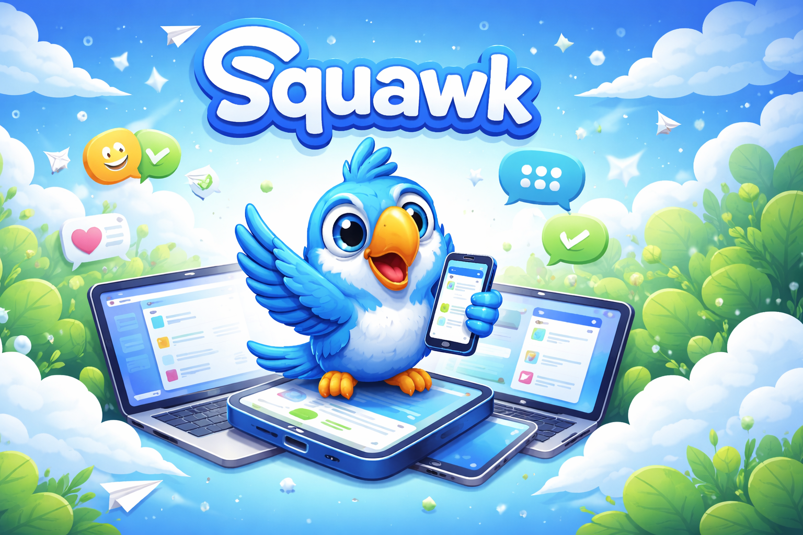
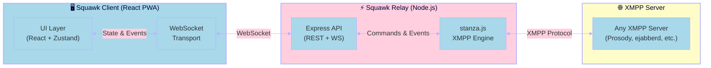
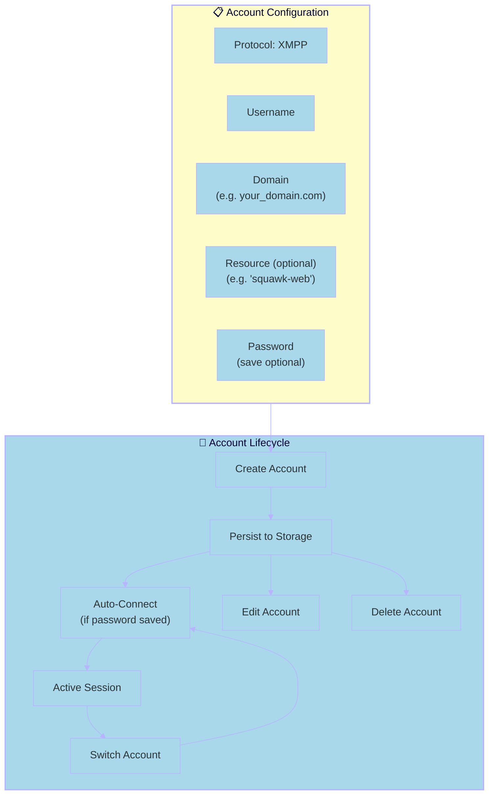
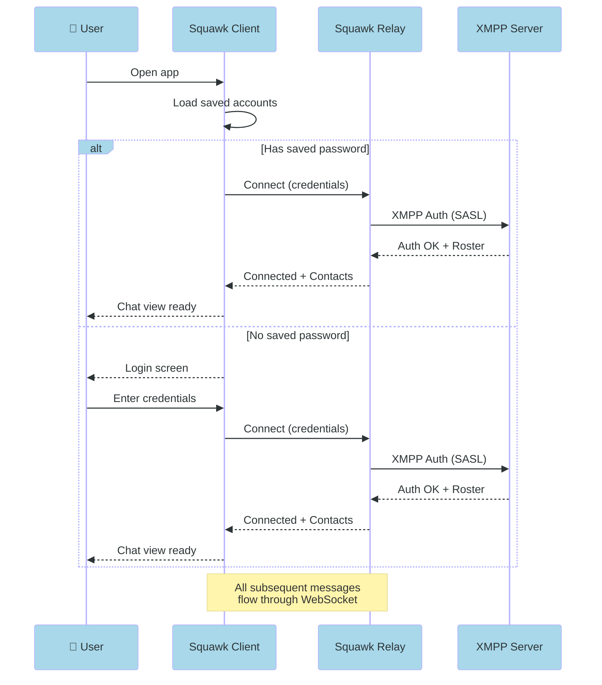
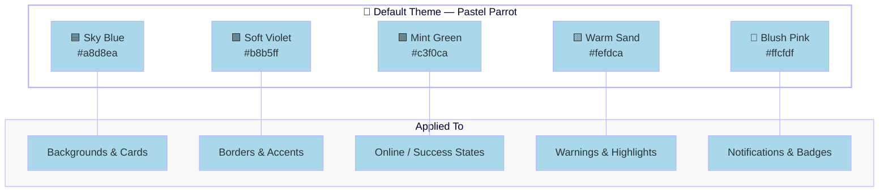
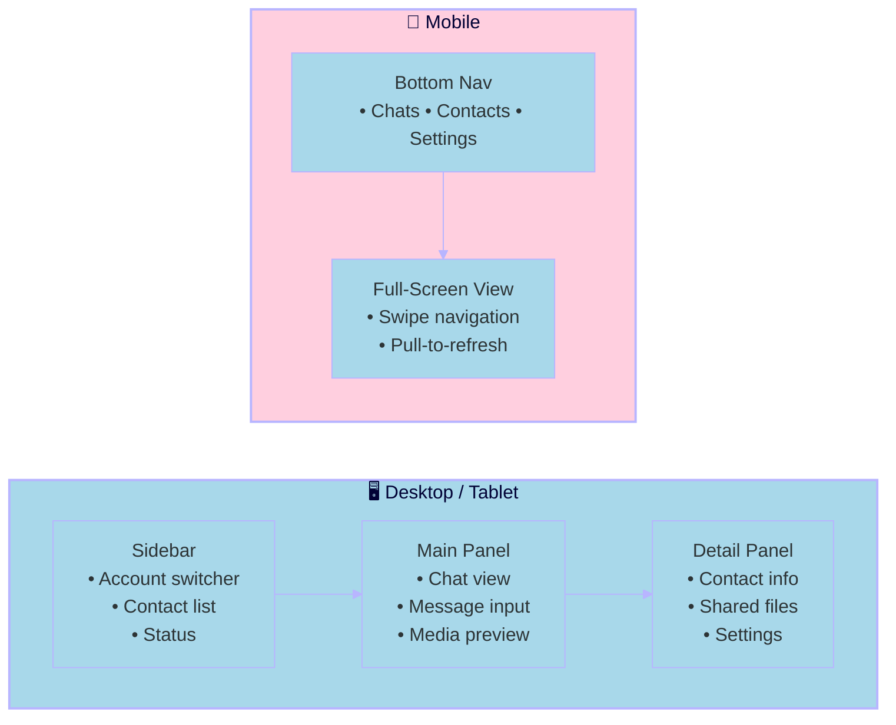

# 

> A modern, cross-platform XMPP client with personality.

Squawk is a cartoon-styled XMPP (Jabber) chat client built for the modern web and beyond. Connect to any XMPP server — Goonfleet, Prosody, ejabberd, whatever speaks the protocol.

---

## Architecture



## Why a Relay Server?

The relay architecture gives us:
- **No CORS/BOSH headaches** — the relay speaks native XMPP to the server
- **Account management server-side** — encrypted credential storage, auto-reconnect
- **Push notification support** — relay stays connected even when client disconnects
- **Protocol abstraction** — client speaks simple WebSocket JSON, relay handles XMPP XML

---

## Account Model



### Account Behaviour

| Action | Detail |
|--------|--------|
| **First launch** | Account setup wizard — minimal fields, friendly UX |
| **Saved password** | Auto-connects on app open |
| **Multiple accounts** | Switch freely; last-used becomes default |
| **Persistence** | Accounts stored locally (IndexedDB) with optional password save |
| **Resource** | Auto-generated if not specified (e.g. `squawk-<random>`) |

---

## Connection Flow



---

## UI Design

### Theme

Squawk uses a **cartoon-styled UI** with pastel colours derived from a mascot illustration. The palette adapts based on the active theme.



### Layout (Responsive)



---

## Tech Stack

| Layer | Technology | Why |
|-------|-----------|-----|
| **Client Framework** | React 18 + TypeScript | Component model, massive ecosystem, PWA-ready |
| **Build Tool** | Vite 6 | Near-instant HMR, no webpack pain |
| **State** | Zustand | Tiny, fast, no boilerplate |
| **Styling** | CSS Modules + CSS Custom Properties | Theming via variables, no runtime cost |
| **Routing** | React Router 7 | Standard, works with PWA |
| **Relay Server** | Node.js + Express | Same language as client, npm ecosystem |
| **XMPP Engine** | stanza.js | Best JS XMPP library, browser + Node |
| **WebSocket** | ws (server) + native (client) | Real-time relay communication |
| **Storage** | IndexedDB (Dexie.js) | Offline-capable account & message persistence |
| **PWA** | Workbox | Offline support, installable on all platforms |
| **Native Wrapper** | Capacitor (future) | iOS/Android from same codebase, zero platform hacks |

---

## Project Structure

```
squawk/
├── client/                    # React PWA
│   ├── src/
│   │   ├── components/        # UI components
│   │   │   ├── accounts/      # Account management
│   │   │   ├── chat/          # Chat interface
│   │   │   ├── contacts/      # Contact list
│   │   │   ├── layout/        # Shell, sidebar, nav
│   │   │   └── shared/        # Buttons, inputs, cards
│   │   ├── hooks/             # Custom React hooks
│   │   ├── stores/            # Zustand state stores
│   │   ├── services/          # WebSocket & API clients
│   │   ├── theme/             # CSS variables & theme config
│   │   ├── types/             # TypeScript interfaces
│   │   ├── utils/             # Helpers
│   │   ├── App.tsx
│   │   └── main.tsx
│   ├── public/
│   │   └── mascot.svg         # Squawk mascot
│   ├── index.html
│   ├── vite.config.ts
│   ├── tsconfig.json
│   └── package.json
├── relay/                     # Node.js XMPP relay
│   ├── src/
│   │   ├── xmpp/              # stanza.js XMPP client management
│   │   ├── ws/                # WebSocket server
│   │   ├── routes/            # REST API routes
│   │   ├── types/             # Shared types
│   │   └── index.ts
│   ├── tsconfig.json
│   └── package.json
├── shared/                    # Shared types & protocols
│   ├── src/
│   │   ├── messages.ts        # WebSocket message contracts
│   │   └── account.ts         # Account interfaces
│   ├── tsconfig.json
│   └── package.json
├── .gitignore
└── README.md                  # This file — the living design doc
```

---

## Getting Started

```bash
# Install dependencies
cd squawk/client && npm install
cd ../relay && npm install
cd ../shared && npm install

# Start development (from project root)
# Terminal 1 — Relay server
cd relay && npm run dev

# Terminal 2 — Client
cd client && npm run dev
```

The client opens at `http://localhost:5173` with hot reload.
The relay listens on `ws://localhost:3001`.

---

## Roadmap

### Phase 1 — Connection & Accounts ← **We are here**
- [x] Project scaffold & architecture
- [ ] Account CRUD (create, edit, delete, switch)
- [ ] XMPP connection via relay
- [ ] Auto-connect on launch
- [ ] Connection status indicators

### Phase 2 — Chat
- [ ] 1:1 messaging
- [ ] Group chat (MUC)
- [ ] Message history (MAM)
- [ ] Typing indicators
- [ ] Read receipts

### Phase 3 — Contacts & Presence
- [ ] Roster management
- [ ] Presence status (online, away, DND)
- [ ] Contact search
- [ ] Avatar support

### Phase 4 — Rich Features
- [ ] File transfer
- [ ] Image/media preview
- [ ] Emoji picker
- [ ] Notifications (push via relay)
- [ ] End-to-end encryption (OMEMO)

### Phase 5 — Native
- [ ] Capacitor wrapping for iOS/Android
- [ ] Native notifications
- [ ] Background connection persistence

---

*Built with 🦜 and questionable taste in colour palettes.*
